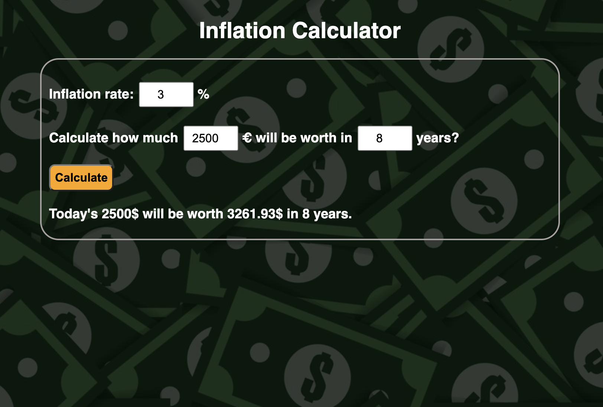

# Inflation-calculator

Since there is an inflation rate, money becomes less valuable over time. The inflation calculator calculates how much _x_ money :euro: will be worth in _y_ years :hourglass: if the inflation rate is _z_% :chart:.

